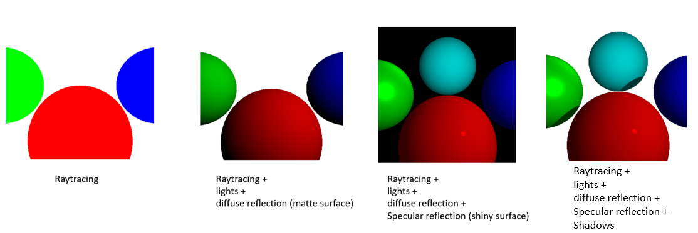
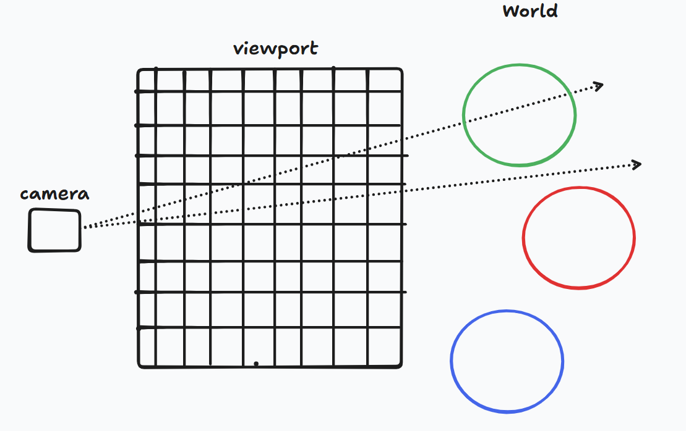
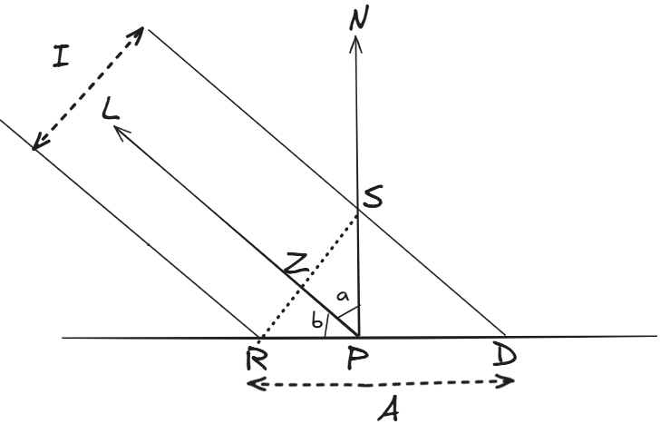
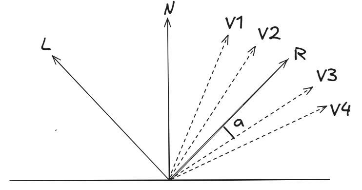
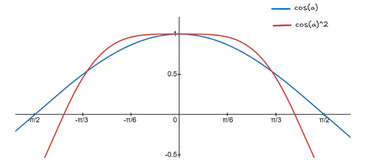
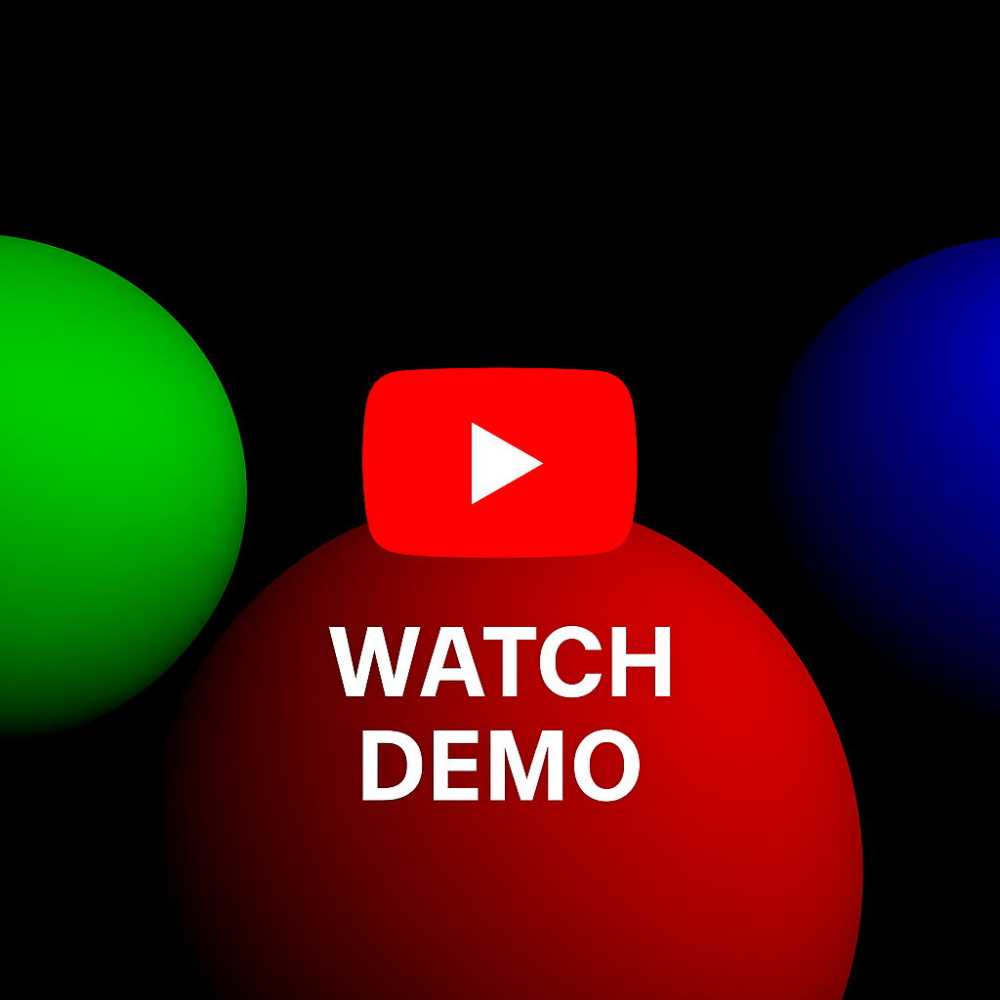

# CPU Raytracer

A simple CPU-based ray tracer written in **vanilla JavaScript**, rendering directly to an HTML5 `<canvas>` element — no WebGL, no external libraries.

---

## Current Progress

✅ New features:

- Pointer-controlled camera rotation around the Y-axis. Turns the camera left or right (like shaking your head "no").
- Check index.html file on Github repo for example code.
- Pixel buffer integration — huge improvement in camera movement smoothness
- Progressive rendering + buffer: paint only after ~1% of pixels are ready → keeps the main thread responsive
- 🎥 [Watch this on YouTube](https://youtu.be/b1Qhd_gh1zU) — See how camera movement becomes noticeably smoother with pixel buffer vs. without it. It is a work in progress!

✅ How it works?

- check the [Camera rotation](https://github.com/SPK1997/CPURaytracer#camera-rotation) section

✅ Features so far:

- Ray-object intersections (sphere for now)
- Diffuse reflection (matte surfaces)
- Specular reflection (shiny surfaces)
- Shadows
- Multithreading
- Progressive rendering
- Camera rotation (along +ve Y axis)

🔄 Next Up

- More performace boosts and smoother camera movements
- More degrees of freedom for camera (pitch/X-axis, roll/Z-axis)
- More shapes: Triangles, Planes, etc.



---

## Project Structure

### `src/CanvasManager.js`

Responsible for creating, updating, and destroying the canvas element used for rendering.

### `src/RaytracingManager.js`

- Starts and stops web workers.
- Progressively loads pixels.

### `src/mathServices.js`

Contains vector algebra and geometry utilities used by the ray tracer.

### `src/RaytracingWorker.js`

Contains the web worker logic which is the core ray tracing logic:

- Generates rays.
- Computes intersections from shape data.
- Computes reflections (matte, specular, other objects on surface) and shadows from lighting data.

---

## Getting Started

To run the raytracer locally:

1. Clone github repository.
2. To build the project run command `npm i` and then `npm run build`
3. Serve `index.html` in any modern browser. If using VSCode try Live Server Extension.
4. Watch the pixel-by-pixel ray tracing in action.
5. Alternatively, NPM package `'raytrace-engine'` can be installed and used.

---

## Understanding the `index.html` File

Appropriate comments are added to `index.html`. It is advised to read it alongside this explanation:

### Usage

1. To use this raytrace engine, you need two managers: `CanvasManager` and `RaytracingManager`.

2. The options provided to `CanvasManager` during instantiation are:

   - `target`: An HTML element which will contain the HTML canvas element.
   - `height`: Height of the canvas.
   - `width`: Width of the canvas.

3. The options provided to `RaytracingManager` during instantiation are:
   - `canvasHeight`: Determines viewport height.
   - `canvasWidth`: Determines viewport width.
   - `cameraPosition`: The `{x, y, z}` coordinates of the camera.
   - `distanceFromCameraToViewport`: Distance `D` from the camera to the viewport.
   - `shapeData`: An array of objects describing each shape (currently only spheres supported).
   - `lightData`: An array of objects describing light sources.
   - `noIntersectionColor`: Background color when a ray hits nothing.
   - `reflectiveRecursionLimit`: Max number of bounces for reflective rays.
   - `putPixelCallback`: A callback that receives an array of pixel objects `{x, y, color}` to render on the canvas.

---

## `shapeData` Format

Each object in `shapeData` represents a sphere.

### Required properties:

- `center`: `{ x, y, z }` — position of the sphere in 3D space.
- `radius`: `number` — radius of the sphere.
- `color`: `{ r, g, b }` — color of the sphere (0–255 for each channel).

### Optional properties:

- `specular`: `number` — higher values make the surface shinier (e.g., 500 for glossy, 0 for matte).
- `reflective`: `number` (0 to 1) — determines how reflective the surface is. `1` is a mirror, `0` means no reflection.

### Example:

```js
shapeData = [
  {
    center: { x: 0, y: -1, z: 3 },
    radius: 1,
    color: { r: 255, g: 0, b: 0 },
    specular: 500,
  },
  {
    center: { x: -1.5, y: 0.5, z: 3 },
    radius: 1,
    color: { r: 255, g: 255, b: 255 },
    specular: 500,
    reflective: 0.9,
  },
  {
    center: { x: 1.5, y: 1, z: 3 },
    radius: 1,
    color: { r: 0, g: 255, b: 0 },
    specular: 800,
  },
];
```

---

## `lightData` Format

There are 3 types of supported lights:

### Ambient Light

```js
{
  type: "ambient",
  intensity: 0.2, // Value between 0 and 1
}
```

- Applies uniform brightness to the entire scene.

### Point Light

```js
{
  type: "point",
  intensity: 0.6,
  position: { x: 2, y: 1, z: 0 }
}
```

- Emits light from a specific position like a bulb.

### Directional Light

```js
{
  type: "directional",
  intensity: 0.2,
  direction: { x: 1, y: 4, z: 4 }
}
```

- Simulates light from a distant source like the sun.

---

## Understanding how to use types

- The below example shows how to use the types provided with NPM package raytrace-engine.

```js
import {
  CanvasManager,
  RaytracingManager,
  Pixel, // type
  Light, // type
  Shape, // type
  CanvasManagerProps, // type
  RaytracingManagerProps, // type
  EnablePointerMovementsProps, // type
} from "raytrace-engine";

// Set canvas dimensions
let canvasHeight = 720;
let canvasWidth = 1080;

// Camera setup
let distanceFromCameraToViewport = 1;
let cameraPosition = { x: 0, y: 0, z: 0 };

// SHAPE DEFINITIONS
let shapeData: Shape[] = [];

/* Example scene with 3 spheres:
           - Red sphere in the center
           - White reflective sphere to the left
           - Green shiny sphere to the right
        */
shapeData.push(
  {
    center: { x: 0, y: -1, z: 3 },
    radius: 1,
    color: { r: 255, g: 0, b: 0 }, // Red
    specular: 500, // How shiny it is
  },
  {
    center: { x: -1.5, y: 0.5, z: 3 },
    radius: 1,
    color: { r: 255, g: 255, b: 255 }, // White
    specular: 500,
    reflective: 0.9, // Very reflective
  },
  {
    center: { x: 1.5, y: 1, z: 3 },
    radius: 1,
    color: { r: 0, g: 255, b: 0 }, // Green
    specular: 800, // Very shiny
  }
);

// LIGHT DEFINITIONS
let lightData: Light[] = [
  {
    type: "ambient", // Applies uniformly to the whole scene
    intensity: 0.2,
  },
  {
    type: "point", // Emits light from a specific position in space
    intensity: 0.6,
    position: { x: 2, y: 1, z: 0 },
  },
  {
    type: "directional", // Light with a direction but no position (like sunlight)
    intensity: 0.2,
    direction: { x: 1, y: 4, z: 4 },
  },
];

// Create and display the canvas
let cmOptions: CanvasManagerProps = {
  target: document.getElementById("root") as HTMLDivElement,
  height: canvasHeight,
  width: canvasWidth,
};
let cm = new CanvasManager(cmOptions);
cm.showCanvas();

// throttle the pointer move event handler calls
function throttle(fn, delay = 50) {
  let lastCall = 0;
  return (...args) => {
    const now = Date.now();
    if (now - lastCall >= delay) {
      lastCall = now;
      fn(...args);
    }
  };
}

// Adding pointer movements to the canvas in order to change camera angle
// This will use pointe events which will be useful for Touch devices also
// Pointer movements can be disabled. Use disablePointerMovements() method on Canvas Manager instance.
let prevClientX = null;
let enablePointerMovementsOptions:EnablePointerMovementsProps = {
  pointerdown: (e) => {
    prevClientX = e.clientX;
  },
  pointermove: throttle((e) => {
    if (prevClientX !== null) {
      const currentX = e.clientX;
      const diff = currentX - prevClientX;
      prevClientX = currentX;

      // Left swipe → diff < 0 → rotate left
      // Right swipe → diff > 0 → rotate right
      const angle = diff * 0.001;

      // Initially the camera is positioned at {x:0, y:0, z:0} and looks at +ve Z direction into the screen
      // A -ve angle will make the camera look left
      // A +ve angle will make the camera look right
      rm.lookAt(angle);
    }
  }, 16),
  pointerup: (e) => {
    prevClientX = null;
  }
};
cm.enablePointerMovements();

// Options passed to the raytracing engine
let rmOptions: RaytracingManagerProps = {
  canvasHeight: canvasHeight,
  canvasWidth: canvasWidth,
  cameraPosition: cameraPosition,
  distanceFromCameraToViewport: distanceFromCameraToViewport,
  shapeData: shapeData,
  lightData: lightData,
  noIntersectionColor: { r: 255, g: 255, b: 255 }, // Background color
  reflectiveRecursionLimit: 3, // Max depth for recursive reflections
  putPixelCallback: (pixelData: Pixel[]) => {
    cm.putPixel(pixelData); // Draws pixels to the canvas
  },
};

// Start rendering and measure how long it takes
let t1 = window.performance.now();
let rm = new RaytracingManager(rmOptions);
rm.start().then(() => {
  let t2 = window.performance.now();

  // Display render time in top-left corner
  let target = document.getElementById("root");
  let div = document.createElement("div");
  div.innerText = t2 - t1 + " " + "ms";
  div.style.position = "absolute";
  div.style.top = "0px";
  div.style.left = "0px";
  div.style.backgroundColor = "black";
  div.style.color = "white";
  (target as HTMLDivElement).append(div);
});
```

---

For more details about the ray tracing algorithm, see the theoretical notes below and [source code](./src).

## Raytracing Algo

- Ray tracing begins with a **scene**.
- A scene consists of a **camera**, a **viewport**, and a **3D world**.
- Think of the **camera** as an eye and the **viewport** as a screen with small square openings. Each opening corresponds to a pixel on the canvas.
- For every square (or pixel) on the viewport, a **ray is cast** from the camera through it into the 3D world.
- If the ray intersects a 3D object, the corresponding pixel on the canvas is painted with the color of that object at the point of intersection.



---

## Modelling Lighting

### Types of Light Sources

**Based on origin:**

- **Emissive Light**: Light emitted directly from a source (e.g., bulb, sun).
- **Scattered Light**: Light reflected off surfaces. Acts as a secondary source.

**Based on mathematical modeling:**

- **Point Light**: Light originates from a single point. Each surface point has a different light vector (e.g., a bulb).
- **Directional Light**: Light comes from a far-away source. All surface points share the same direction vector (e.g., sunlight).
- **Ambient Light**: A constant, low-intensity light representing indirect scattering from the environment.

### Surface Types

- **Matte Surface**: Reflects light equally in all directions (diffuse reflection).
- **Shiny Surface**: Reflects light in a specific direction (specular reflection).

### Diffuse Reflection Calculation



To compute how a matte surface reflects light:

- **I**: Light intensity (thickness of the light beam)
- **A**: Surface area over which the light spreads
- **L**: Light vector (from point to light source)
- **N**: Surface normal at the point
- **a**: Angle between L and N

**Reflected Intensity = Light Intensity x (I/A) = Light Intensity × cos(a)**

- When a approaches 0 degrees, the ratio I/A approaches 1 (maximum reflection)
- When a approaches 90 degrees, A approaches infinity, the ratio I/A approaches 0 (no reflection)

To compute how I/A is same as cos(a) from the diagram:

- angle SPR = a + b = 90 degrees
- angle ZRP = 90 degrees - b = a
- cosine(a) = RZ/RP = (I/2) / (A/2) = I/A

This models how light spreads over a larger area at shallow angles, thus reducing its intensity.

### Specular Reflection Calculation



To compute how a **shiny surface** reflects light:

- **L** — Light vector (from the point on the surface to the light source)
- **N** — Surface normal at that point
- **R** — Perfectly reflected light vector
- **Vi** — View vectors (e.g., **V1, V2, V3, V4**) from the point toward the camera
- **a** — Angle between the reflected light vector (**R**) and a view vector (e.g., **V3**)

No surface is perfectly smooth — meaning light isn't only reflected in the exact direction of **R**, but also slightly around it. This gives rise to **specular highlights**, which appear brighter when:

- The view direction is aligned with the reflected light
- The surface is highly polished or shiny

We calculate the reflected light intensity as follows:

**Reflected Intensity = Light Intensity × (cos(a))^specular**

- The `specular` exponent determines how shiny the surface is.
- **Higher values** produce smaller, sharper highlights.
- **Lower values** produce broader, softer highlights.
- This is because higher specular value makes the cosine curve narrower. Check the image below for **cos(a)^b**



When **a = 0 degrees** (perfect alignment), the intensity is **maximum**.
As **a increases toward 90 degrees**, intensity **drops rapidly**.
Raising **cos(a)** to a high power compresses the reflection into a narrow beam — simulating a shiny surface.

### Working of Raytracing and Light

During ray tracing, if the ray vector does not intersect with anything, then `{ r: 0, g: 0, b: 0 }` is returned.

If the ray intersects with something, then depending on the intensity of light reflected by the surface, its color is modified like:

`{ r: valueR * ReflectedLightIntensity, g: valueG * ReflectedLightIntensity, b: valueB * ReflectedLightIntensity }`

Therefore, when no lights are present, it will be pitch black as shown in below video:

[](https://www.youtube.com/watch?v=PY25eGugKfM)

---

## Modelling Shadows

- In raytracing we cast a ray from camera and find its intersection with an object.
- From the point of intersection (P) towards the light source we have a vector called the light vector (L) which we saw earlier in lights modelling section.
- We form a new ray vector of the form P + t\*L where t is a positive number and can vary, P and L are 3D vectors.
- This ray starts at the intersection point and travels in the direction of the light source.
- If this shadow ray intersects any other object before reaching the light, it means the light is blocked, and point P lies in shadow.
- If no object obstructs the shadow ray, then the light reaches point P, and we proceed with lighting calculations (diffuse, specular)

---

## Modelling Reflections of other objects on surface

To make surfaces look shiny or mirror-like, we simulate how light bounces off them. When a ray of light hits a reflective object, we send another ray in the direction it would bounce — just like how you'd see your reflection in a mirror.

This new ray continues the same process: it might hit something else, reflect again, and so on. We recursively repeat this bounce a few times to create realistic reflections, but stop after a set limit to avoid infinite loop (like mirror infront of mirror scenario)

Limitation
Right now, all of this happens on the main thread — and since every pixel may involve multiple recursive rays, the UI can freeze. Using Web Workers to offload this heavy computation can make rendering much smoother and faster.

---

## Camera rotation

Currently it is possible to rotate camera along +ve Y-axis/Yaw

In raytracing the idea is to cast a ray from camera into the scene and compute intersections. Therefore on camera rotation the direction vector of the ray changes. Which is calculated by transforming the vector with a rotation matrix.

---

## Notes

- This raytracer runs entirely on the CPU using `CanvasRenderingContext2D`
- No WebGL, no Three.js, no shaders — just math and canvas

---
