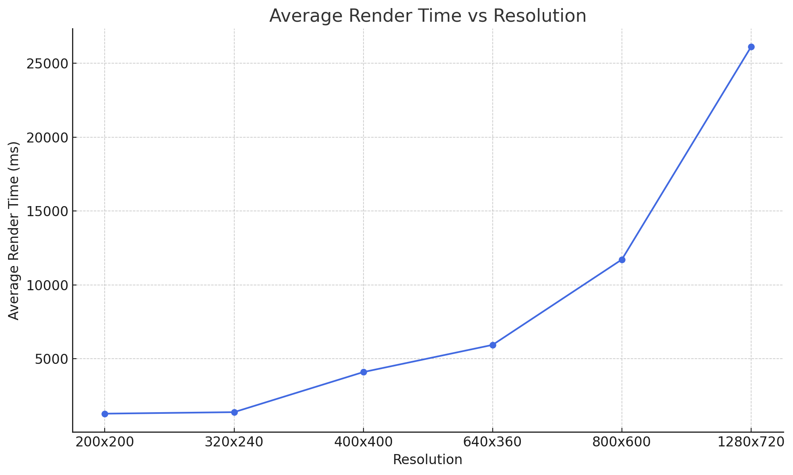

# CPU Raytracer

A simple CPU-based ray tracer written in **vanilla JavaScript**, rendering directly to an HTML5 `<canvas>` element — no WebGL, no external libraries.

---

## Current Progress

- New Milestone: Added web workers and measured performance by rendering 882 spheres in a 3D grid.

- The chart shows the performance for different resolutions

- Performance Benchmarks:

  **Resolutions Tested: 200x200 to 1280x720**

  **Data: 882 spheres in a 3D Grid**

  **Processor: 12th Gen Intel(R) Core(TM) i5-1235U 1.30 GHz**

  **Threads: 12**

---

## Project Structure

### CPURaytracer/CanvasManager.js

Responsible for creating, updating, and destroying the canvas element used for rendering.

### CPURaytracer/RaytracingManager.js

Core ray tracing logic:

- Generates rays
- Computes intersections
- Handles rendering flow

### CPURaytracer/mathServices.js

Contains vector algebra and geometry utilities used by the ray tracer, such as:

- Vector operations
- Dot product, subtraction, normalization
- Ray-sphere intersection calculations

---

## Entry Point Files

### index.html

The main HTML file that bootstraps the app and mounts the canvas.

### index.css

Styling for the web interface.

### index.js

Main JavaScript entry point:

- Initializes managers
- Starts the render loop
- Connects DOM with the raytracer engine

---

## Getting Started

To run the raytracer locally:

1. Clone this repository
2. Open `index.html` in any modern browser
3. Watch the pixel-by-pixel ray tracing in action

---

## Raytracing Algo

- Ray tracing begins with a **scene**.
- A scene consists of a **camera**, a **viewport**, and a **3D world**.
- Think of the **camera** as an eye and the **viewport** as a screen with small square openings. Each opening corresponds to a pixel on the canvas.
- For every square (or pixel) on the viewport, a **ray is cast** from the camera through it into the 3D world.
- If the ray intersects a 3D object, the corresponding pixel on the canvas is painted with the color of that object at the point of intersection.

---

## Modelling Lighting

### Types of Light Sources

**Based on origin:**

- **Emissive Light**: Light emitted directly from a source (e.g., bulb, sun).
- **Scattered Light**: Light reflected off surfaces. Acts as a secondary source.

**Based on mathematical modeling:**

- **Point Light**: Light originates from a single point. Each surface point has a different light vector (e.g., a bulb).
- **Directional Light**: Light comes from a far-away source. All surface points share the same direction vector (e.g., sunlight).
- **Ambient Light**: A constant, low-intensity light representing indirect scattering from the environment.

### Surface Types

- **Matte Surface**: Reflects light equally in all directions (diffuse reflection).
- **Shiny Surface**: Reflects light in a specific direction (specular reflection).

### Diffuse Reflection Calculation

To compute how a matte surface reflects light:

- **I**: Light intensity (thickness of the light beam)
- **A**: Surface area over which the light spreads
- **L**: Light vector (from point to light source)
- **N**: Surface normal at the point
- **a**: Angle between L and N

**Reflected Intensity = Light Intensity x (I/A) = Light Intensity × cos(a)**

- When a approaches 0 degrees, the ratio I/A approaches 1 (maximum reflection)
- When a approaches 90 degrees, A approaches infinity, the ratio I/A approaches 0 (no reflection)

To compute how I/A is same as cos(a) from the diagram:

- angle SPR = a + b = 90 degrees
- angle ZRP = 90 degrees - b = a
- cosine(a) = RZ/RP = (I/2) / (A/2) = I/A

This models how light spreads over a larger area at shallow angles, thus reducing its intensity.

### Specular Reflection Calculation

To compute how a **shiny surface** reflects light:

- **L** — Light vector (from the point on the surface to the light source)
- **N** — Surface normal at that point
- **R** — Perfectly reflected light vector
- **Vi** — View vectors (e.g., **V1, V2, V3, V4**) from the point toward the camera
- **a** — Angle between the reflected light vector (**R**) and a view vector (e.g., **V3**)

No surface is perfectly smooth — meaning light isn't only reflected in the exact direction of **R**, but also slightly around it. This gives rise to **specular highlights**, which appear brighter when:

- The view direction is aligned with the reflected light
- The surface is highly polished or shiny

We calculate the reflected light intensity as follows:

**Reflected Intensity = Light Intensity × (cos(a))^specular**

- The `specular` exponent determines how shiny the surface is.
- **Higher values** produce smaller, sharper highlights.
- **Lower values** produce broader, softer highlights.
- This is because higher specular value makes the cosine curve narrower. Check the image below for **cos(a)^b**

When **a = 0 degrees** (perfect alignment), the intensity is **maximum**.  
As **a increases toward 90 degrees**, intensity **drops rapidly**.  
Raising **cos(a)** to a high power compresses the reflection into a narrow beam — simulating a shiny surface.

### Working of Raytracing and Light

During ray tracing, if the ray vector does not intersect with anything, then `{ r: 0, g: 0, b: 0 }` is returned.

If the ray intersects with something, then depending on the intensity of light reflected by the surface, its color is modified like:

`{ r: valueR * ReflectedLightIntensity, g: valueG * ReflectedLightIntensity, b: valueB * ReflectedLightIntensity }`

Therefore, when no lights are present, it will be pitch black as shown in below video:

---

## Modelling Shadows

- In raytracing we cast a ray from camera and find its intersection with an object.
- From the point of intersection (P) towards the light source we have a vector called the light vector (L) which we saw earlier in lights modelling section.
- We form a new ray vector of the form P + t\*L where t is a positive number and can vary, P and L are 3D vectors.
- This ray starts at the intersection point and travels in the direction of the light source.
- If this shadow ray intersects any other object before reaching the light, it means the light is blocked, and point P lies in shadow.
- If no object obstructs the shadow ray, then the light reaches point P, and we proceed with lighting calculations (diffuse, specular)

---

## Modelling Reflections of other objects on surface

To make surfaces look shiny or mirror-like, we simulate how light bounces off them. When a ray of light hits a reflective object, we send another ray in the direction it would bounce — just like how you'd see your reflection in a mirror.

This new ray continues the same process: it might hit something else, reflect again, and so on. We recursively repeat this bounce a few times to create realistic reflections, but stop after a set limit to avoid infinite loop (like mirror infront of mirror scenario)

Limitation
Right now, all of this happens on the main thread — and since every pixel may involve multiple recursive rays, the UI can freeze. Using Web Workers to offload this heavy computation can make rendering much smoother and faster.

---

## Notes

- This raytracer runs entirely on the CPU using `CanvasRenderingContext2D`
- No WebGL, no Three.js, no shaders — just math and canvas

---

## Planned Work

🔄 Next Up

- Experiment further with performance
- Refactor core logic for clarity and scalability
- Add TypeScript declaration files for typed usage
- Write clean docs so this can be used in other projects
- Build a lightweight raytracer NPM package
