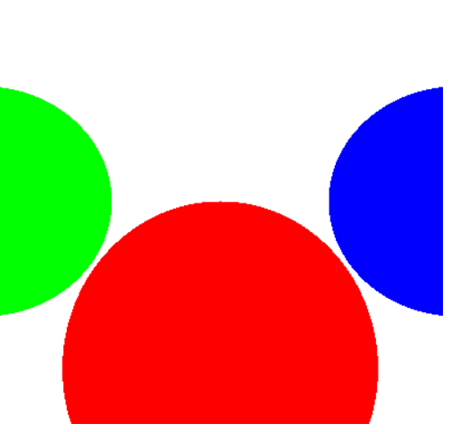

# CPU Raytracer

A simple CPU-based ray tracer written in **vanilla JavaScript**, rendering directly to an HTML5 `<canvas>` element — no WebGL, no external libraries.

---

## Current Progress

---

## Project Structure

### CPURaytracer/EventsManager.js

Handles adding and removing event listeners to the DOM.

### CPURaytracer/CanvasManager.js

Responsible for creating, updating, and destroying the canvas element used for rendering.

### CPURaytracer/RaytracingManager.js

Core ray tracing logic:

- Generates rays
- Computes intersections
- Handles rendering flow

### CPURaytracer/mathServices.js

Contains vector algebra and geometry utilities used by the ray tracer, such as:

- Vector operations
- Dot product, subtraction, normalization
- Ray-sphere intersection calculations

---

## Entry Point Files

### index.html

The main HTML file that bootstraps the app and mounts the canvas.

### index.css

Styling for the web interface.

### index.js

Main JavaScript entry point:

- Initializes managers
- Starts the render loop
- Connects DOM with the raytracer engine

---

## Getting Started

To run the raytracer locally:

1. Clone this repository
2. Open `index.html` in any modern browser
3. Watch the pixel-by-pixel ray tracing in action

---

## Notes

- This raytracer runs entirely on the CPU using `CanvasRenderingContext2D`
- No WebGL, no Three.js, no shaders — just math and canvas

---

## Planned Work

- Add lighting (diffuse, specular)
- Support multiple object types (planes, boxes, etc.)
- Build a lightweight raytracer NPM package
- Port math engine to WebAssembly for performance
