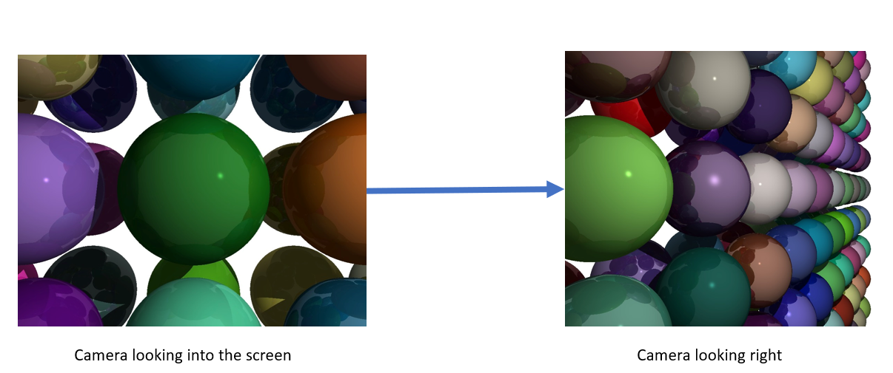

# CPU Raytracer

A simple CPU-based ray tracer written in **vanilla JavaScript**, rendering directly to an HTML5 `<canvas>` element — no WebGL, no external libraries.

---

## Current Progress

---

## Raytracing Algo

- Ray tracing begins with a **scene**.
- A scene consists of a **camera**, a **viewport**, and a **3D world**.
- Think of the **camera** as an eye and the **viewport** as a screen with small square openings. Each opening corresponds to a pixel on the canvas.
- For every square (or pixel) on the viewport, a **ray is cast** from the camera through it into the 3D world.
- If the ray intersects a 3D object, the corresponding pixel on the canvas is painted with the color of that object at the point of intersection.

---

## Lighting Model

### Types of Light Sources

**Based on origin:**

- **Emissive Light**: Light emitted directly from a source (e.g., bulb, sun).
- **Scattered Light**: Light reflected off surfaces. Acts as a secondary source.

**Based on mathematical modeling:**

- **Point Light**: Light originates from a single point. Each surface point has a different light vector (e.g., a bulb).
- **Directional Light**: Light comes from a far-away source. All surface points share the same direction vector (e.g., sunlight).
- **Ambient Light**: A constant, low-intensity light representing indirect scattering from the environment.

### Surface Types

- **Matte Surface**: Reflects light equally in all directions (diffuse reflection).
- **Shiny Surface**: Reflects light in a specific direction (specular reflection).

### Diffuse Reflection Calculation

To compute how a matte surface reflects light:

- **I**: Light intensity (thickness of the light beam)
- **A**: Surface area over which the light spreads
- **L**: Light vector (from point to light source)
- **N**: Surface normal at the point
- **a**: Angle between L and N

**Reflected Intensity = Light Intensity × cos(α)**

- When a → 0 degrees, cos(a) → 1 (maximum reflection)
- When a → 90 degrees, cos(a) → 0 (no reflection)

This models how light spreads over a larger area at shallow angles, thus reducing its intensity.

---

## Project Structure

### CPURaytracer/EventsManager.js

Handles adding and removing event listeners to the DOM.

### CPURaytracer/CanvasManager.js

Responsible for creating, updating, and destroying the canvas element used for rendering.

### CPURaytracer/RaytracingManager.js

Core ray tracing logic:

- Generates rays
- Computes intersections
- Handles rendering flow

### CPURaytracer/mathServices.js

Contains vector algebra and geometry utilities used by the ray tracer, such as:

- Vector operations
- Dot product, subtraction, normalization
- Ray-sphere intersection calculations

---

## Entry Point Files

### index.html

The main HTML file that bootstraps the app and mounts the canvas.

### index.css

Styling for the web interface.

### index.js

Main JavaScript entry point:

- Initializes managers
- Starts the render loop
- Connects DOM with the raytracer engine

---

## Getting Started

To run the raytracer locally:

1. Clone this repository
2. Open `index.html` in any modern browser
3. Watch the pixel-by-pixel ray tracing in action

---

## Notes

- This raytracer runs entirely on the CPU using `CanvasRenderingContext2D`
- No WebGL, no Three.js, no shaders — just math and canvas

---

## Planned Work

- Add lighting (specular)
- Support multiple object types (planes, boxes, etc.)
- Build a lightweight raytracer NPM package
- Port math engine to WebAssembly for performance
